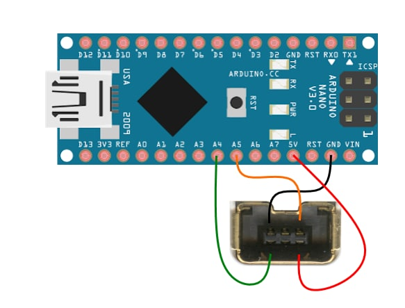

# Luchabots
¡Lucha libre de robots!  

La carpeta Programación contiene programas de Arduino.  
Los Luchabots que hemos construido usan un control inalámbrico NES Classic compatible con Wii. El receptor usa protocolo I2C y es fácil interpretar y leer los comandos con Arduino.  

`NES_ClassicCtrl` no usa una librería externa  
`NES_Classic_Sumo` usa la librería [NintendoExtensionCtrl](https://github.com/dmadison/NintendoExtensionCtrl).  
`NES_Classic_Huevo` es una modificación del anterior. Es el código del Luchabot B-tito. Usa Arduino Nano.  
`Michibot` usa la misma librería. Es el código para la placa controladora hexagonal. Usa ESP32.  
Otro código está en el repo https://github.com/Inventoteca/AkilesBoy  

Más info y librerías relacionadas con controles de Wii  
https://create.arduino.cc/projecthub/infusion/using-a-wii-nunchuk-with-arduino-597254
https://github.com/nyh-workshop/nesClassicController
https://github.com/jlamothe/NESController
https://pinouts.ru/Game/nintendo_nunchuk_pinout.shtml

